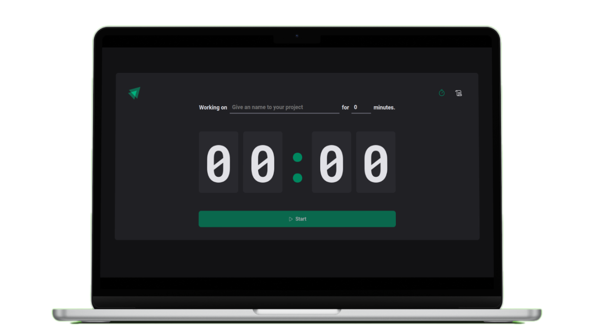

<h3 align="center">
    
</h3>

<h1 align="center">Pomodoro Timer</h1>

<p align="center">
<a href="#project"></a>&nbsp;
<a href="#environment"></a>&nbsp;
<a href="#license"></a>&nbsp;
</p>

<h3 align="center">
  
</h3>

## Project

### Summary:

Pomodoro Timer is a React-based open-source project developed with Vite, utilizing cutting-edge technologies to provide an efficient time management solution using the Pomodoro technique.
This project offers an intuitive and user-friendly interface, empowering users to control time dedicated to specific projects.

### Technologies Used:

<li> React and Vite: The project is built on React, optimized with the speed of Vite to deliver a fast development experience. </li>
<li> Styled Components: Styled Components is employed for styling, enabling a modular and reusable approach to component styling. </li>
<li> Phosphor React: The Phosphor React library is used for icon addition, contributing to an attractive and intuitive visual interface. </li>
<li> Immer: Immer is utilized for managing immutability in data, enhancing data manipulation and state updates. </li>
<li> Date-fns: Utilizing Date-fns, the project manages and formats time-related information, ensuring accurate and user-friendly display. </li>
<li> React Router Dom: To facilitate navigation between different sections of the application, React Router Dom is integrated, providing a seamless user experience. </li>
<li> React Hook Form: React Hook Form is employed to simplify and optimize form handling within the application. </li>
<li> Zod: To ensure proper data validation, Zod is used, guaranteeing that user inputs meet the expected requirements. </li>

### Key Features:

<li> Project Configuration: Users can configure and name specific projects they are working on.</li>
<li> Adjustable Pomodoro Timer: The application offers flexibility in adjusting the Pomodoro timer from 5 to 60 minutes, catering to individual needs.</li>
<li> Progress History Page: Track progress on work done for each project through an intuitive history page.</li>
<li> Local Storage Storage: Essential data is stored locally, ensuring persistence and the ability to resume work even after closing the browser.</li>

### Skills Developed:

<li> Prop Drilling: Understanding and effective application of prop drilling to manage data flow between components.</li>
<li> Context API: Implementation of React's Context API for efficient sharing of state between components.</li>
<li> React Reducer Hook (useReducer): Use of the React Reducer Hook to simplify state logic and action handling.</li>
<li> Clean Code: Emphasis on writing clean and readable code to promote maintainability and effective collaboration.</li>
<li> Lint Configuration: Implementation of linting practices to maintain code consistency and quality.</li>
<li> Styled Components: Practical application of Styled Components for modular and maintainable styling.</li>
<li> Local Storage Storage: Practical application of local storage for preserving essential data between sessions.</li>

## Demo:

<p align="center">

</p>

- [Deploy](https://timer-pomodoro-six.vercel.app/)

> `Alert 1:` For optimal experience, it is advisable not to use IE 6-8 as a browser due to certain styling features.

## Environment

Make sure you have the following installations:

- [Git](https://git-scm.com/)
- [Node](https://nodejs.org/en)
- [Npm](https://www.npmjs.com/)

### Setup Instructions:

1. Clone the repository:
   ```bash
   https://github.com/CaioLemec/timer-pomodoro.git
   ```
2. Install all dependencies by running:
   ```bash
   npm i
   ```
3. Start the application in <strong>dev</strong> mode:
   ```bash
   npm run dev
   ```

---

## License

Licensed under MIT. Learn more in the [LICENSE](/LICENSE) file.

---

## Contact

Feel free to reach out for clarifications or feedback.


<em align="center">Caio Lemec</em>

[](mailto:caiolemec@gmail.com)
[](https://www.linkedin.com/in/caiolemec/)
